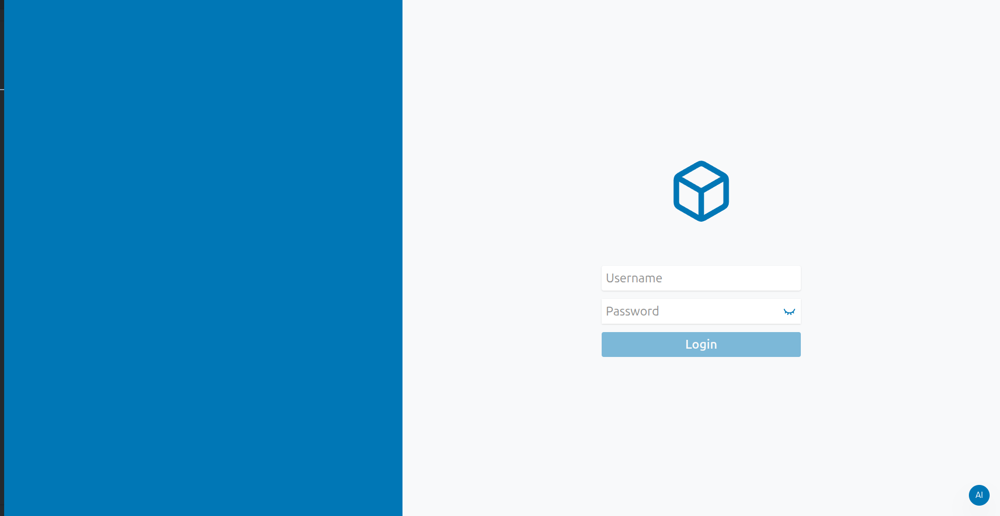
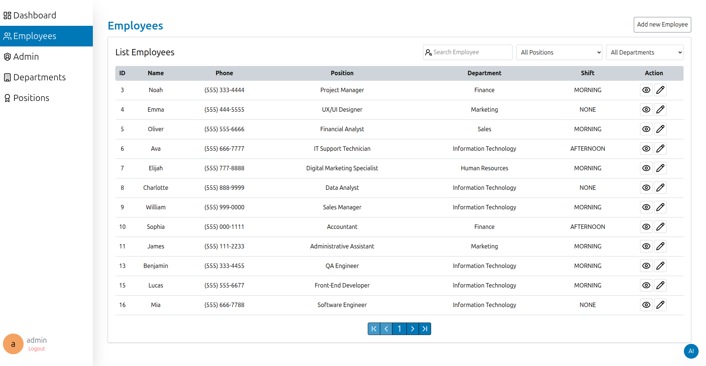
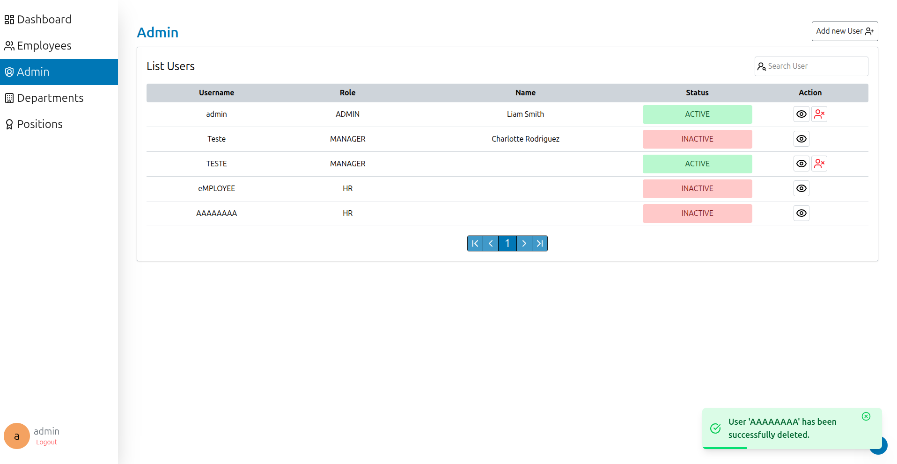
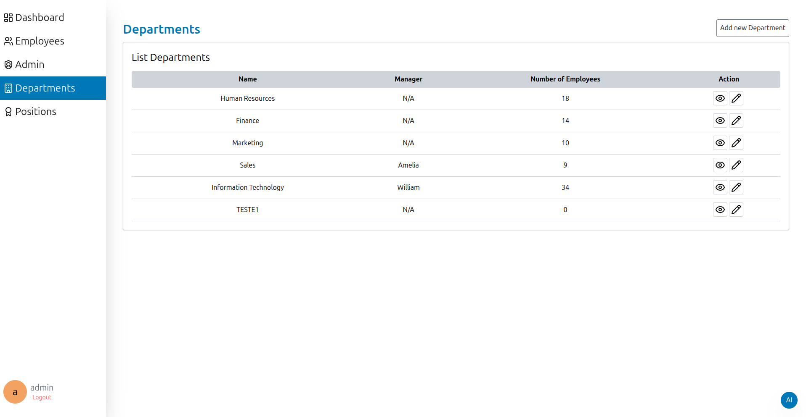
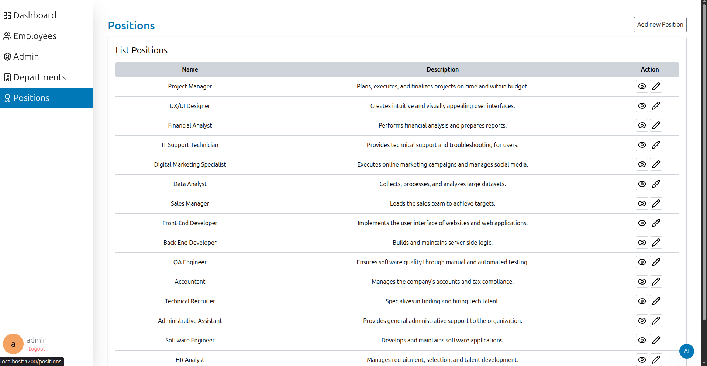
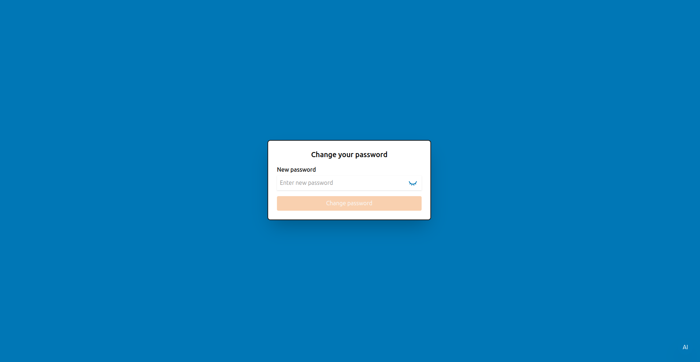
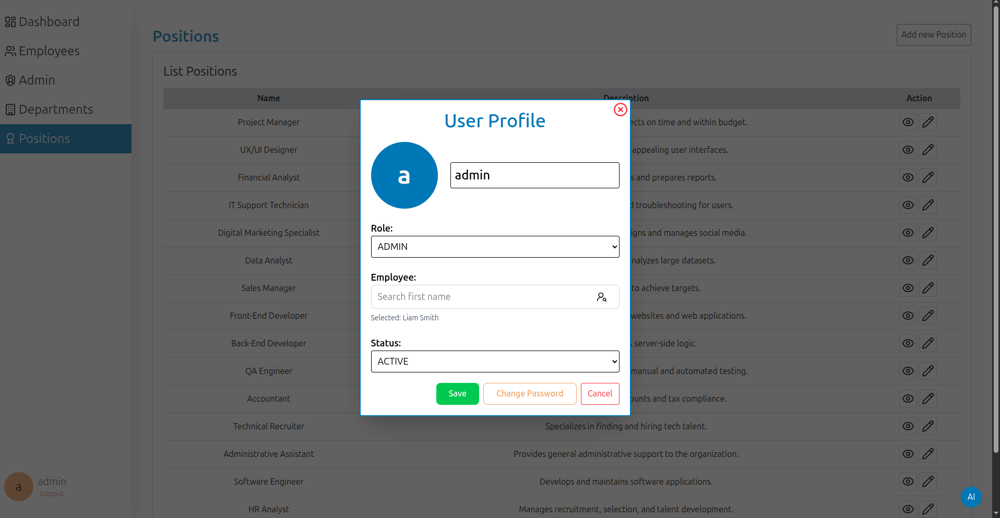

# HR System

Sistema de Gerenciamento de RH full-stack com assistente de IA. Backend desenvolvido em Spring Boot, frontend em Angular e IA com Ollama e Spring AI.

## Sobre o Projeto

O HR System é uma aplicação full-stack projetada para agilizar e simplificar as operações de RH. Ele oferece uma interface amigável e funcionalidades abrangentes para gerenciar funcionários, departamentos, cargos e usuários. Além disso, o sistema inclui um dashboard intuitivo com as principais métricas de RH e um assistente de bate-papo com tecnologia de IA para ajudar os usuários a encontrar informações rapidamente.

## Como ficou









## Features

  * **Autenticação de Usuário:** Sistema de login seguro com autenticação baseada em token JWT.
  * **Gerenciamento de Funcionários:** Crie, visualize, edite e gerencie perfis de funcionários.
  * **Gerenciamento de Departamentos:** Crie e gerencie os departamentos da empresa.
  * **Gerenciamento de Cargos:** Crie e gerencie os cargos da empresa.
  * **Controle de Acesso Baseado em Função:** Diferentes níveis de acesso para administradores, gerentes e usuários de RH.
  * **Dashboard de RH:** Visualize as principais métricas, como total de funcionários, funcionários por status, aniversariantes do mês e contratações recentes.
  * **Assistente de Chat com IA:** Um assistente de bate-papo inteligente para responder a perguntas sobre funcionários, cargos e departamentos.
  * **Paginação e Pesquisa:** Navegue e pesquise facilmente por funcionários e usuários.

## Tecnologias

Este projeto foi desenvolvido com as seguintes tecnologias:

**Backend:**

  * Java 21
  * Spring Boot 3.5.0
  * Spring Security
  * Spring Data JPA
  * PostgreSQL com pgvector
  * Maven
  * Flyway
  * Auth0 JWT

**Frontend:**

  * Angular CLI 19.0.5
  * TypeScript
  * Tailwind CSS
  * Lucide Icons

**Outras:**

  * Docker
  * Ollama

## Começando

Siga as instruções abaixo para configurar e executar o projeto em sua máquina local.

### Pré-requisitos

Certifique-se de ter o seguinte software instalado em sua máquina:

  * Java 21 ou superior
  * Maven 3.9.9 ou superior
  * Node.js (que inclui npm)
  * Angular CLI 19.0.5 ou superior
  * Docker

### Instalação

1.  **Clone o repositório:**
    ```bash
    git clone https://github.com/brenoc4rvalho/hr-system.git
    ```
2.  **Navegue até o diretório do projeto:**
    ```bash
    cd hr-system
    ```
3.  **Instale as dependências do frontend:**
    ```bash
    cd frontend
    npm install
    ```
4.  **Volte para o diretório raiz do projeto:**
    ```bash
    cd ..
    ```

### Executando a Aplicação

1.  **Configure as variáveis de ambiente:**

    Crie um arquivo `.env` na raiz do projeto e adicione as seguintes variáveis de ambiente. Você pode usar o arquivo `.env.example` como modelo.

    ```bash
    POSTGRES_HOST=localhost
    POSTGRES_PORT=5432
    POSTGRES_USER=seu-usuario
    POSTGRES_DB=hr-system
    POSTGRES_PASSWORD=sua-senha
    DATABASE_URL=jdbc:postgresql://${POSTGRES_HOST}:${POSTGRES_PORT}/${POSTGRES_DB}
    ```

2.  **Inicie os serviços do Docker:**

    Na raiz do projeto, execute o seguinte comando para iniciar o banco de dados PostgreSQL com a extensão pgvector:

    ```bash
    npm run services:up
    ```

3.  **Execute a aplicação:**

    Use o seguinte comando para iniciar os servidores de backend e frontend simultaneamente:

    ```bash
    npm run dev
    ```

    O servidor de backend será executado em `http://localhost:8080` e o servidor de frontend será executado em `http://localhost:4200`.

## Estrutura do Projeto

```
hr-system/
├── backend/
│   ├── src/
│   │   ├── main/
│   │   │   ├── java/com/example/backend/
│   │   │   └── resources/
│   │   │       ├── db/
│   │   │       │   ├── migration/
│   │   │       │   └── init/
│   │   │       └── prompts/
│   │   └── test/
│   └── pom.xml
├── frontend/
│   ├── src/
│   │   ├── app/
│   │   ├── assets/
│   │   └── environments/
│   └── angular.json
├── .env.example
├── compose.yaml
└── README.md
```

## Endpoints da API

A API de backend fornece os seguintes endpoints:

  * `POST /auth`: Autentica um usuário e retorna um token JWT.
  * `GET /users`: Retorna uma lista paginada de usuários.
  * `POST /users`: Cria um novo usuário.
  * `GET /users/{id}`: Retorna um usuário por ID.
  * `PUT /users/{id}`: Atualiza um usuário.
  * `DELETE /users/{id}`: Exclui um usuário.
  * `GET /employees`: Retorna uma lista paginada de funcionários.
  * `POST /employees`: Cria um novo funcionário.
  * `GET /employees/{id}`: Retorna um funcionário por ID.
  * `PUT /employees/{id}`: Atualiza um funcionário.
  * `GET /departments`: Retorna uma lista de departamentos.
  * `POST /departments`: Cria um novo departamento.
  * `GET /departments/{id}`: Retorna um departamento por ID.
  * `PUT /departments/{id}`: Atualiza um departamento.
  * `GET /positions`: Retorna uma lista de cargos.
  * `POST /positions`: Cria um novo cargo.
  * `GET /positions/{id}`: Retorna um cargo por ID.
  * `PUT /positions/{id}`: Atualiza um cargo.
  * `GET /chat`: Gera uma resposta do assistente de bate-papo com IA.

## Páginas do Frontend

O aplicativo de frontend inclui as seguintes páginas:

  * **Login:** Página de autenticação do usuário.
  * **Dashboard:** Exibe as principais métricas de RH.
  * **Funcionários:** Lista e gerencia os funcionários.
  * **Admin:** Gerencia usuários e outras configurações do sistema.
  * **Departamentos:** Lista e gerencia os departamentos.
  * **Cargos:** Lista e gerencia os cargos.
  * **Alterar Senha:** Permite que os usuários alterem suas senhas.

## Paleta de Cores

| Cor               | Hex                                                              | Uso                               |
| ----------------- | ---------------------------------------------------------------- | --------------------------------- |
| `primary`         |  `#0077B6` | Cor principal para botões e links |
| `secondary`       |  `#F4A261` | Cor secundária para destaques   |
| `page`            |  `#F8F9FA` | Cor de fundo da página          |
| `component`       |  `#FFFFFF` | Cor de fundo do componente      |
| `gray`            |  `#6C757D` | Cor de texto silenciada         |
| `gray-light`      |  `#CED4DA` | Cor de borda e fundo claro      |
| `deep`            |  `#1E1E1E` | Cor de texto principal          |
| `white-soft`      |  `#F9F9F9` | Cor de texto em fundos escuros  |

## Futuras Funcionalidades

  * **Nível do Cargo:** Adicionar um campo de nível de cargo (por exemplo, Estagiário, Júnior, Pleno, Sênior) aos perfis dos funcionários.
  * **Histórico do Funcionário:** Rastrear o histórico de promoções e alterações de cargo de um funcionário.

## Contribuindo

As contribuições são bem-vindas\! Sinta-se à vontade para abrir uma issue ou enviar um pull request.

## Licença

Este projeto está licenciado sob a Licença ISC.

## Contato

Breno Carvalho - [Seu Perfil do LinkedIn](https://www.google.com/search?q=https://www.linkedin.com/in/brenoc4rvalho/)

Link do Projeto: [https://github.com/brenoc4rvalho/hr-system](https://www.google.com/search?q=https://github.com/brenoc4rvalho/hr-system)